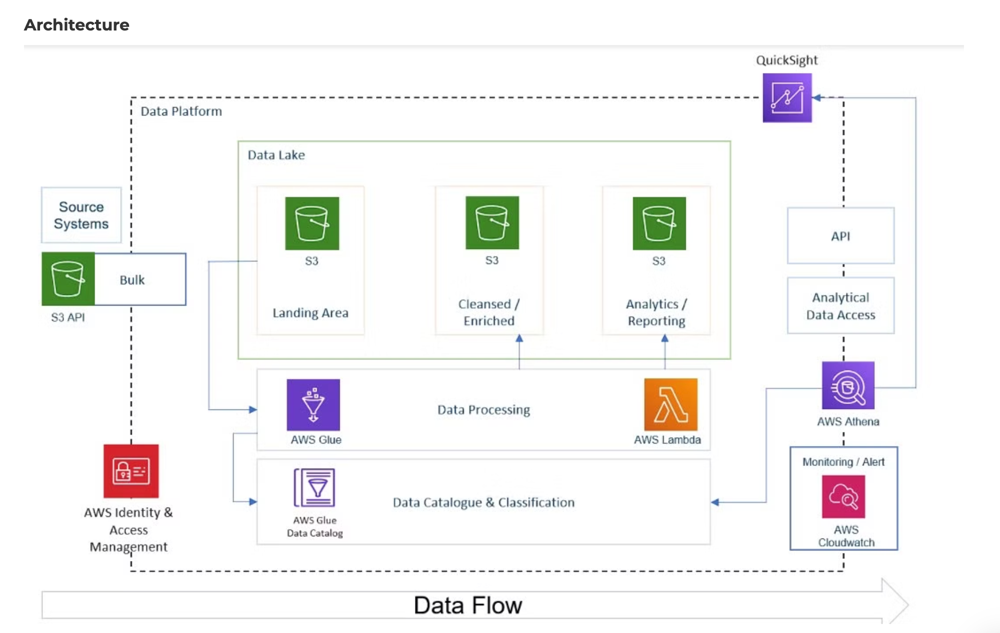
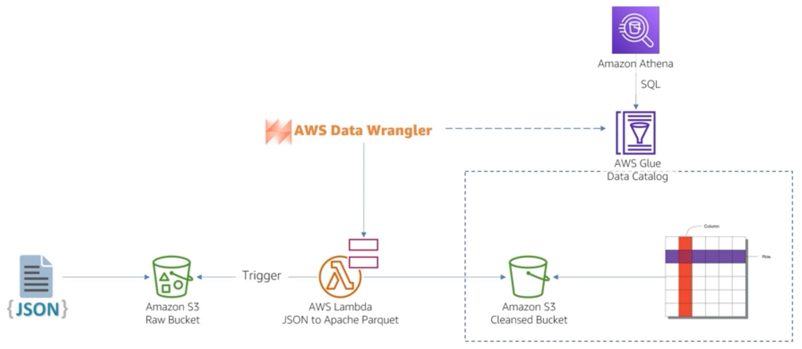
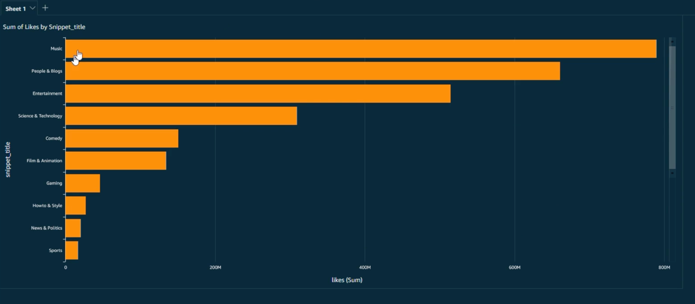
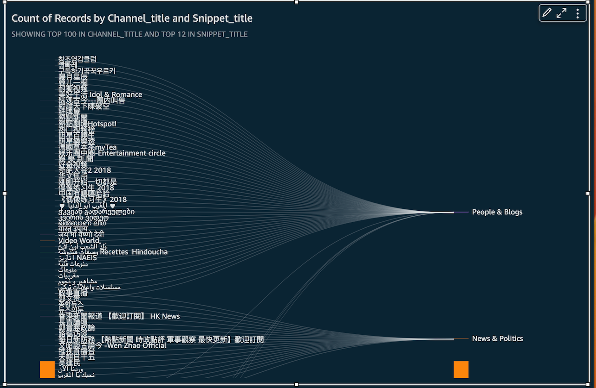

# AWS ETL pipeline on YouTube data using Athena, Glue and Lambda

###### Tech Stack:

➔ Languages: SQL, Python3

➔ Services: AWS S3, AWS Glue, QuickSight, AWS Lambda, AWS Athena, AWS IAM.

###### Architecture

### Summary of Data Architecture:

- The data architecture follows a raw/landing layer, 
a cleansed layer, and an analytics/reporting layer. 
- Data is pushed to the S3 bucket (raw/landing layer) using AWS CLI, 
then transformed, cleansed, and stored in the Cleansed layer, 
optimized in columnar and compressed format.
- The raw zone remains untouched. 
- The data is then materialized and stored in the Analytics/Reporting layer,
by using AWS glue job. 
- Users can then use Amazon Athena from Quicksight via the Glue Data Catalog, 
which queries the analytics/reporting layer. 
- The data in this layer is precomputed, meaning that heavy queries 
like joining of data are not necessary; instead, simple statements
can be run with precomputed data in the analytics/reporting layer. 
- The AWS Glue job is responsible for taking data from the Cleansed 
layer and pushing it to the analytics layer, which occurs hourly or 
every 5 minutes or as configured. 

###### Business Overview:

### Data-Driven YouTube Campaign Launch

We are simulating the following situation: 

The Client aims to launch a data-driven campaign on Youtube, the 2nd most visited website. To achieve this, the client has outlined the following requirements:

- Data Ingestion: The client needs a process to ingest data both one-off and incrementally, every day, every hour.

- Data Lake: Design and build a new data lake in the cloud, specifically in AWS.

- ETL Processes: Develop efficient ETL processes to extract, transform, and load data.

- Scalability: The data architecture should be scalable to meet future growth needs.

- Reporting: Develop a reporting layer that allows business users to easily access insights through drag-and-drop functionality.

By meeting these requirements, our client will have the tools necessary to launch a successful data-driven campaign on Youtube.

### Project summary 

The goal of this project is to identify trending videos on YouTube using the Kaggle dataset, which was collected using YouTube's API. Trending videos are defined based on the number of views, shares, comments, or likes on a YouTube video. The dataset comprises two types of data: semi-structured JSON and structured CSV. To perform analytics, the data must be joined, as the title for a video is present in the JSON file.

### ETL pipeline for transforming JSON data to Parquet format

The workflow consists of several steps starting with data cleansing, 
where JSON data is transformed into Apache Parquet. 

Apache Parquet is optimized at the columnar level, with compression 
techniques such as Snappy.

To convert semi-structured data to structured 
data:

- A trigger mechanism was created in the Lambda Function, which basically 
detects new json files incoming in the S3 bucket (raw layer). 
Tha lambda function detects that in milli seconds. 
- The data is then processed using Data Wrangler (an open source AWS project)
using Lambda layers. 
- Tha Data Wrangler interacts with the catalog and as 
well as pushes the cleansed data to S3 bucket(cleansed layer). 
- Athena Queries can be performed on the transformed JSON data.
- The execution in Lambda layer is performed in parallel so even if 
there is say 1000 JSON files pushed to S3 bucket(raw layer). 
So within a few seconds of data puched to the S3 layer it is processed and can be queried using Athena.

### Conclusion: 

The workflow culminates in a dashboard for business analytics, 
with visualizations such as the most-liked categories and the correlation
between channel title and snippet title (categories).

A few examples from the insights: 
- The dashboard shows that Music is the most-liked category, 
followed by People and blogs, Entertainment, and others. 

Correlation between Channel title and snippet title. 
snippet ttile is categories.

Overall, this workflow effectively identifies trending videos on YouTube, 
making it an efficient and useful data analytics tool, 
by meeting all the requirements by the laid by client namely 
Data Ingestion, Data Lake, ETL Processes, Scalability and Reporting. 