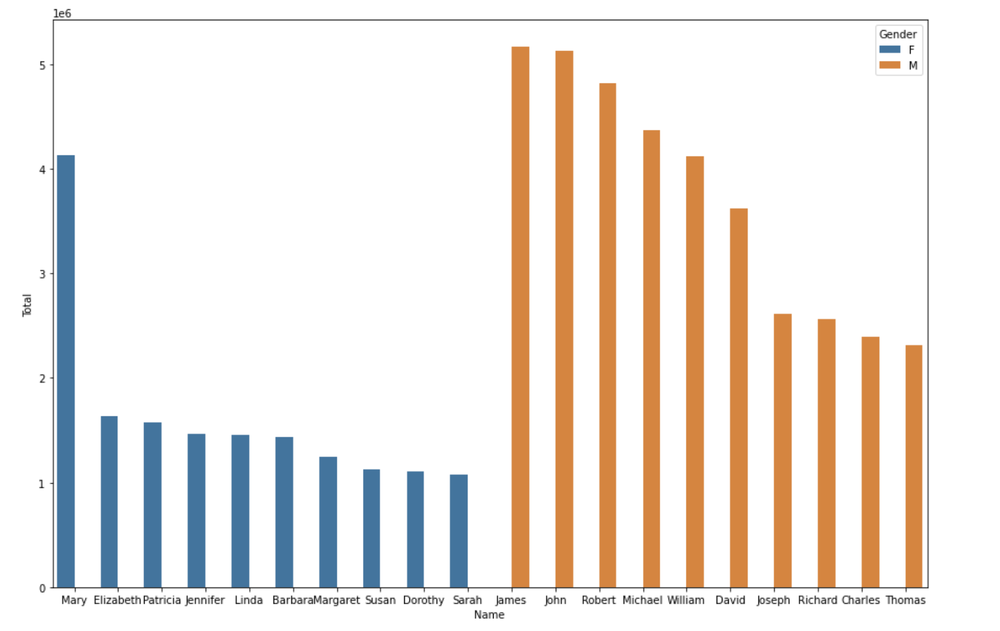
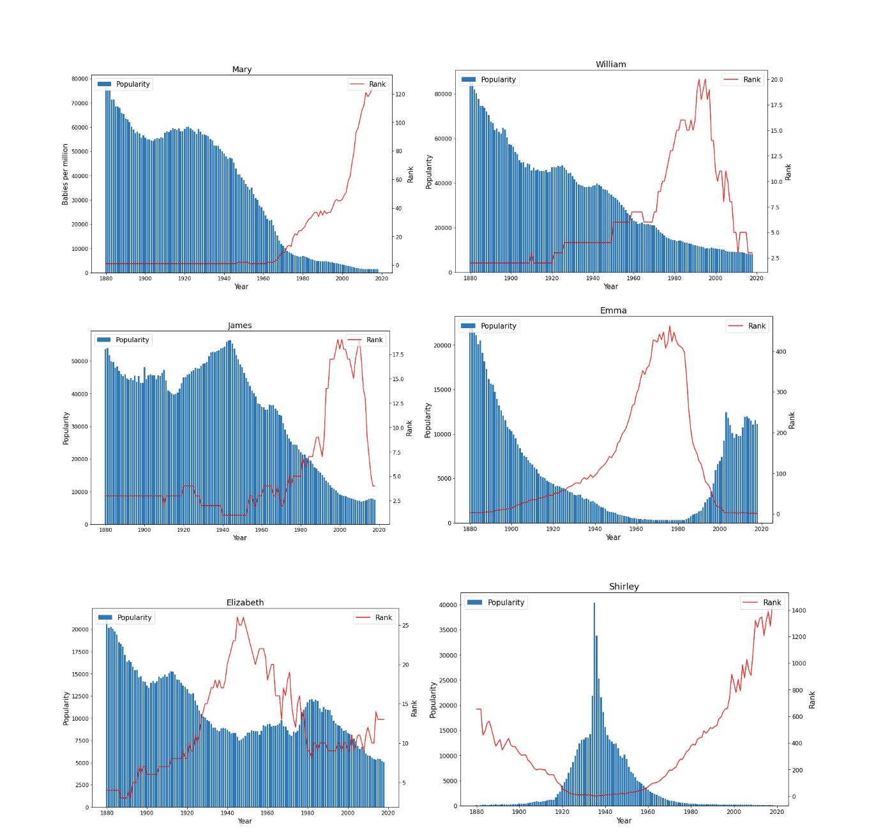

# EDA and Advanced Visualization (Baby Names Dataset)

#### Performed EDA to understand 

- Most popular names in a specific year and all times.
- Visualized using sea born plot 

 - General trends over time 
       - Registered Babies per year 
        - Unique Names per year 
 - Created features "Popularity" and "Rank"
 - Visualized Name trends over time 

 

