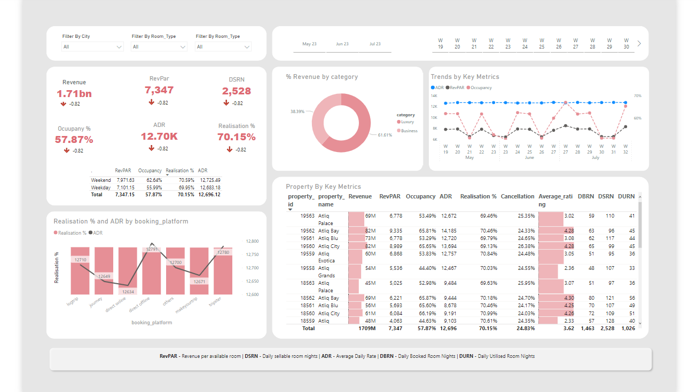

# Hospitality Domain Analysis
This project focuses on creating an interactive dashboard for stakeholders in the hospitality industry to showcase the performance of hotels in terms of key metrics like ADR, Occupancy%, Revenue, Realisation%, RevPAR, etc. over weekdays and weekends. The project also provides valuable insights that can help stakeholders make informed decisions related to dynamic pricing and increase their revenue share in the market.

## Key Metrics
- RevPAR: Revenue per available room
- DSRN: Daily sellable room nights
- ADR: Average daily rate
- DBRN: Daily Booked room nights
- DURN: Daily utilized room nights

## Dashboard Functionality
The interactive dashboard created as part of this project allows stakeholders to:
- Understand revenue across different travel platforms
- Check weekly trends and dynamic pricing of hotels
- Decide on different strategies for weekday and weekend pricing to increase revenue

## Insights
Based on the data analyzed, the following insights were obtained:

- The occupancy% and rating of the hotels seem to be proportional. Stakeholders can increase the rating by going through customer reviews and improve the occupancy%.
- The RevPAR and occupancy% of week on week trends change but the ADR remains constant. This indicates that the hotels do not go for dynamic pricing. By incorporating dynamic pricing, hotels can significantly increase their revenue in seasonal times.
- The ADR for both weekday and weekend is nearly the same, concluding that hotels do not use weekday weekend pricing strategy. This strategy can be incorporated to increase revenue.
## Conclusion
The Hospitality Domain Analysis project provides stakeholders with valuable insights that can help them make informed decisions related to dynamic pricing and increase their revenue share in the market. The interactive dashboard can be used to check weekly trends, understand revenue across different travel platforms, and decide on different pricing strategies for weekdays and weekends.
